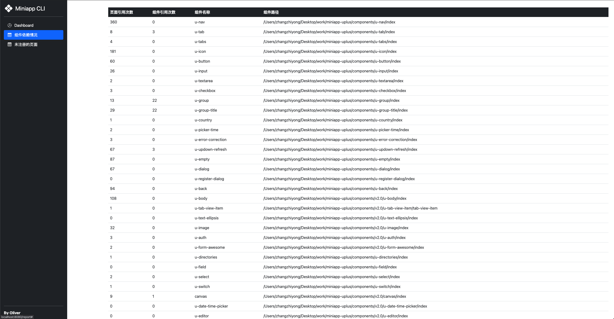
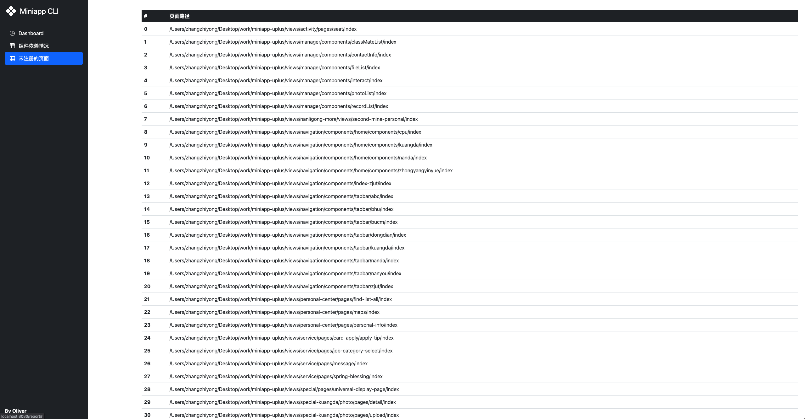

# 动机

为什么要做这个工具？随着小程序项目参与开发的人越来越多，组件和页面也越来越多，主包大小一不留神就会超限，所以做了这个命令行工具来分析小程序组件和页面的情况，方便我们优化小程序。

# 技术栈

1. Node
2. express
3. ejs
4. echart
5. bootstrap

# 功能清单

- [x] 分析小程序组件依赖情况
- [x] 查找出未在 app.json 中注册的页面
- [x] 本地生成报告

# 页面截图

